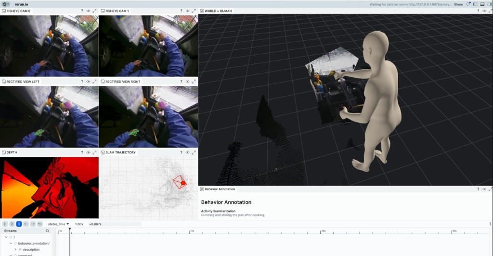

# HumanPlus-1000 Viewer

Tools for **reading** and **visualizing** [HumanPlus-1000](https://huggingface.co/datasets/humanplus-ai/HumanPlus-1000) sessions.

- Load `annotation.hdf5` (calibration, SLAM, body/hand motion, depth, point cloud) in your own scripts
- Visualize stereo fisheye, rectified views, depth, SMPL-H mesh, and the reconstructed world with [Rerun](https://rerun.io)

## Layout

| Path | Description |
|------|-------------|
| `data_loader.py` | Load `annotation.hdf5` (calibration, SLAM, body/hand motion, depth, point cloud) and stereo video. |
| `visualize.py` | `visualize` command: fisheye, rectified + hands, depth, WORLD × HUMAN, SLAM trajectory. |
| `geometry.py` | Helpers: `depth_to_colormap`, `depth_to_pointcloud`, undistort, skeleton. |
| `blueprint.py` | Rerun layout (`create_humanplus_blueprint`). |
| `body_model.py` | Numpy SMPL-H LBS from official `model.npz` (optional mesh). |
| `examples/example_load_annotation.py` | List HDF5 contents, load a session, print a summary. |

## Install

```bash
conda create -n humanplus python=3.11
conda activate humanplus
pip install -r requirements.txt
pip install -e .
```

This installs the `visualize` command. SMPL-H mesh needs the official `model.npz` (`--smplh-model` or `HUMANPLUS_SMPLH_MODEL`). Without it the viewer falls back to the SMPL-24 skeleton.

## Getting Started

Download HumanPlus-1000 sessions from [Hugging Face](https://huggingface.co/datasets/humanplus-ai/HumanPlus-1000). Each session looks like:

```text
HP_S000001/
  fisheye_left.mp4
  fisheye_right.mp4
  annotation.hdf5
  metadata.json
```

### List annotations

```bash
python examples/example_load_annotation.py --data_root /path/to/session
```

Example output:

```
--- annotation.hdf5 contents (top-level) ---
  calibration: group
  video: group
  slam: group
  depth: group
  imu: group
  body_motion: group
  hand_motion: group
  synchronization: group
  behavior_annotation: group

--- Loaded data summary ---
  Frames (video timestamps): N
  Motion frames (sync): N
  body_keypoints: (N, 24, 3)
  smplh_pose: (N, 156)
  slam T_slamworld_camera: (N, 4, 4)
  Hand left/right joints: (N, 21, 3)

--- Calibration ---
  fisheye left K, rectified K, T_head_camera, T_mocapworld_slamworld: available

Done. Use these arrays in your own scripts or pass the session to the viewer.
```

### Visualize

```bash
visualize --session-dir /path/to/session
```

Optional: also write a `.rrd` recording (replay later with `rerun vis.rrd`):

```bash
visualize --session-dir /path/to/session --output-rrd vis.rrd
```



The layout shows stereo fisheye, rectified views with hand overlays, depth, a top-down SLAM trajectory, the SMPL-H body in the reconstructed world, and the activity caption.

## Coordinates

- Body and world display: **mocapworld**, Y-up (`ViewCoordinates.RIGHT_HAND_Y_UP`)
- SLAM points, depth clouds, and camera poses are transformed with `calibration/T_mocapworld_slamworld`
- Hand overlays: `joints_cam = joints_3d (MANO local) + wrist_position_camera`, then rectified with `R_rect_*`

## License

Viewer code is MIT. HumanPlus-1000 data is [CC BY-NC 4.0](https://huggingface.co/datasets/humanplus-ai/HumanPlus-1000).
